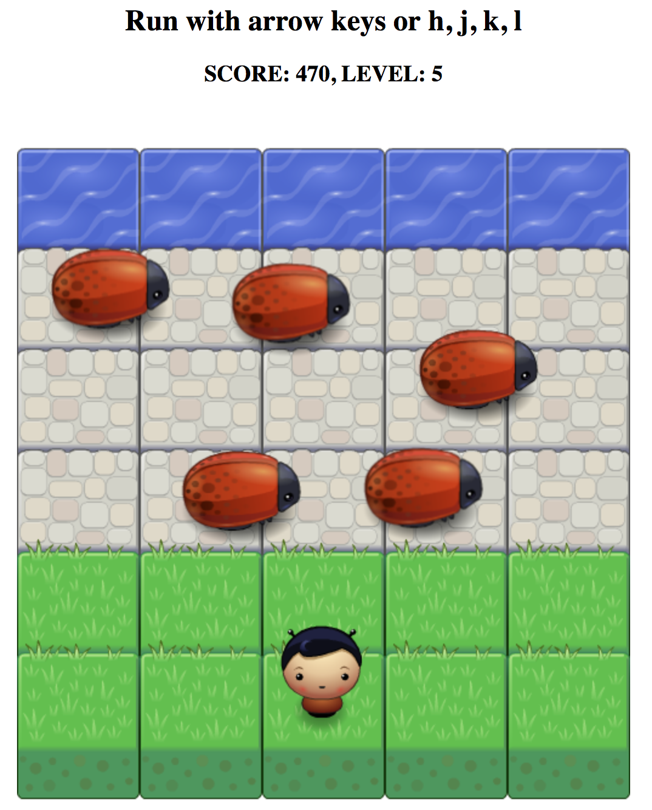

# Udacity Front-End Nanodegree: Arcade Game Clone

## Checkout the game demo [here](https://bunnydeviloper.github.io/FEND-arcade-game/)

[Project rubric](https://review.udacity.com/#!/projects/2696458597/rubric)

## Usage
If you would like to run this application locally or add any new features to the game:
  1. Clone (or fork) the app:  
    `$ [sudo] git clone https://github.com/bunnydeviloper/FEND-arcade-game.git`
  2. Easy open (make sure you `cd` into the app's directory):  
    `$ open index.html` (MacOS) or `start index.html` (Windows)
  3. Alternatively, you can run a simple server and open the app:  
    `$ [sudo] python -m SimpleHTTPServer`, then navigate to `localhost:8000` in your browser

### Basic Functionality
In this game you have a Player and Enemies (Bugs).  
The goal of the player is to reach the water, without colliding into any one of the enemies.  
The player can move left, right, up and down.  
The enemies move in varying speeds on the paved block portion of the scene.  
Once a the player collides with an enemy, the game is reset and the player moves back to the start square.  
Once the player reaches the water the game is won.  

### Additional Functionality
* Player selection: user may select different character before starting the game
* Score: score is increase by 100 each time the player reaches the water, reduce -30 each collision occurs, and reset to 0 when it's negative (game over)
* (WIP) Collectibles: add gems to the game, allowing the player to collect them to make the game more interesting.

### Contributing:
1. Fork it!
2. Create your feature branch: `git checkout -b my-new-feature`
3. Commit your changes: `git commit -m "Add a new awesome feature"`
4. Push to the branch: `git push origin my-new-feature`
5. Submit and pull request.

